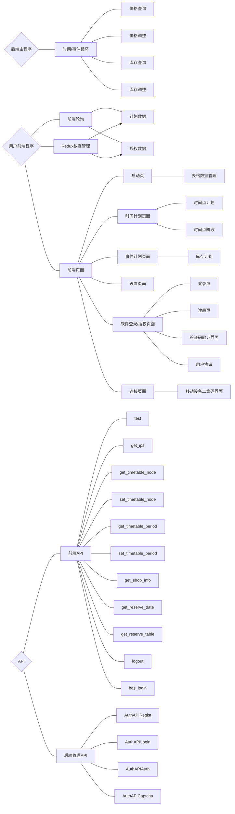
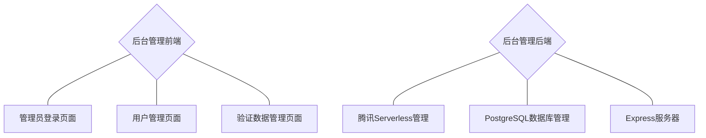
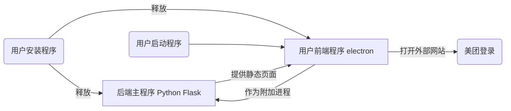

## 架构图

### 用户程序架构

```mermaid
graph LR
	main{后端主程序} --- mainLoop[时间/事件循环]
	
	mainLoop --- loopPriceData[价格查询]
	mainLoop --- loopPrice[价格调整]
	mainLoop --- loopStockData[库存查询]
	mainLoop --- loopStock[库存调整]

	frontend{用户前端程序} --- frontendLoop[前端轮询]
	frontendLoop --- loopPlanData[计划数据]
	frontendLoop --- loopAuthData[授权数据]

	frontend --- frontendPages[前端页面]
	
	frontendPages --- frontendDash[启动页]
	frontendDash --- frontendDashTable[表格数据管理]
	
	frontendPages --- frontendTimePlan[时间计划页面]
	frontendTimePlan --- timeplanNode[时间点计划]
	frontendTimePlan --- timeplanPeriod[时间点阶段]
	
	frontendPages --- frontendEventPlan[事件计划页面]
	frontendEventPlan --- frontendStockPlan[库存计划]
	
	frontendPages --- frontendSettings[设置页面]
	frontendPages --- frontendVerify[软件登录/授权页面]
	
	frontendVerify --- frontendLogin[登录页]
	frontendVerify --- frontendRegist[注册页]
	frontendVerify --- frontendCaptcha[验证码验证界面]
	frontendVerify --- frontendLic[用户协议]
	
	frontendPages --- frontendConnect[连接页面]
	frontendConnect --- frontendConnectCode[移动设备二维码界面]
	
	frontend --- frontendDate[Redux数据管理]
	frontendDate --> loopPlanData
	frontendDate --> loopAuthData
	
	API{API}
	
	API --- fAPI[前端API]
		fAPI --- test
      	fAPI ---get_ips
      	fAPI ---get_timetable_node
      	fAPI ---set_timetable_node
      	fAPI ---get_timetable_period
      	fAPI ---set_timetable_period
      	fAPI ---get_shop_info
      	fAPI ---get_reserve_date
      	fAPI ---get_reserve_table
      	fAPI ---logout
      	fAPI ---has_login
	
	API --- AuthAPI[后端管理API]
        AuthAPI --- AuthAPIRegist
        AuthAPI --- AuthAPILogin
        AuthAPI --- AuthAPIAuth
        AuthAPI --- AuthAPICaptcha
	
	
	
	
```

### 服务程序架构

```mermaid
graph TD
	adminFrontend{后台管理前端}
        adminFrontend --- adminFrontendLogin[管理员登录页面]
        adminFrontend --- adminFrontendUsers[用户管理页面]
        adminFrontend --- adminFrontendCaptcha[验证数据管理页面]
	admin{后台管理后端}
		admin --- adminSls[腾讯Serverless管理]
		admin --- adminData[PostgreSQL数据库管理]
		admin --- adminserver[Express服务器]
	
```

### 程序运行环境

```mermaid
graph LR

userInstall(用户安装程序)
    userInstall -->|释放| main[后端主程序 Python Flask]
    userInstall -->|释放| frontend[用户前端程序 electron]
    
userLaunch(用户启动程序)
	userLaunch --> frontend -->|作为附加进程| main
	main -->|提供静态页面| frontend
	frontend -->|打开外部网站| meituanLogin(美团登录)
```

